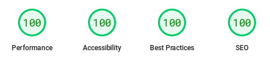
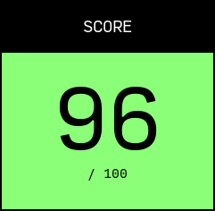

Durante este año han sido muchas veces las que se me ha pasado por la cabeza actualizar mi sitio web. El anterior, andaba algo desactualizado, no por falta de interes, sino porque desde que me cambié de portatil no fui capaz de hacer funcionar Grow de nuevo, lo reconozco.

Probé varios generadores, los populres Astro, Nuxt y Next, y otros menos conocidos. Finalmente me decanté por **[11ty](//11ty.dev)**, basado en **JavaScript** y con una gran retro compatibilidad, lo he podido arrancar en varios entornos desde cero con solo `npm install` sin ir más lejos.

## Decisiones

Con 11ty es muy fácil crear un sitio, bastan unos pocos minutos, pero tambien ofrece versatilidad para crear lo que quieras. [Grow](//grow.io/) es un generador de sitios estáticos escrito en Python que usa plantillas Jinja2, muy similares a Twig, algo a lo que ya estaba acostumbrado.

> Intenté crear el web más rápido que pude

Yo me decanté por usar **[WebC](https://www.11ty.dev/docs/languages/webc/)**, me gusta la idea de Single Files Components (SFC). A partir de esto usé el template base que recoge el CSS y JS genérico, y cada componente provee de su propio CSS y JS si lo necesita. Por ejemplo, el script para el reslatado de sintaxis solo se descarga en los posts y no en el resto de páginas.

Para los estilos utilicé una filosofía **sin clases**, las proias etiquetas y su posición ya determinan que estilo debe tener. A fin de cuentas esto aporta homogeneidad a todo el site y tambien mejora el rendimiento, al usar hojas de estilos más pequeñas y añadir menos código al html.

## Rendimiento

Hablando de rendimiento, en las pruebas de [PageSpeed Insights](//pagespeed.web.dev/analysis/https-tomascornelles-com/zevwfnslac?form_factor=mobile) este site obtuvo 100 en todos los análisis tanto en desktop como en mobile.

Algo que ralentiza mucho la carga de una web son las imágenes. Decidí **prescindir de todas las imágenes** que no sean imprescindibles, así que me quedo con el logo y el favicon, ambos son **svg** embebidos en sus componentes, aunque anadí una imagen de [lorem.picsum](//picsum.photos) de fondo del logo para lograr el lenguaje que quiero transmitir con la nuea marca. Las imagenes de los posts, si son archivos subidos expresamente, pero al menos os evito descargar una hero image para decorar la cabecera 😆.

> Sin imágenes, sin colores, sin librerias

Otra de las cosas que penaliza al cargar un site son las librerias y fuentes externas. Ambas las he minimizado, solo uso una para resaltado de sintaxis en los posts y **las fuentes se descargan despues** de haber cargado todo el web.

Además también estuve pendiente de la accesibilidad, realizando pruebas en [Accesibility Test](//accessibilitytest.org/results/U9tEJTvb8UFd), usando herramientas para lectura en pantalla y un buen contraste de colores entre otras cosas. La jerarquía de encabezados, el uso correcto de `role`, y otros puntos que iban marcado las diferentes pruebas hasta conseguir resolverlos todos.

El sitio web utiliza un esquema de color de **alto contraste**, con solo blanco y negro. También hay un **modo oscuro** que utiliza negro y blanco. La **jerarquía del contenido** es evidente en el espaciado entre elementos, el uso de dos fuentes, `Source Code Pro` para código, encabezados y algunos enlaces de navegación, y `Lora` para el cuerpo del texto.

El uso de blanco y negro es una buena opción para la **accesibilidad**, ya que proporciona un buen contraste para las personas con discapacidades visuales. El uso de dos fuentes ayuda a **distinguir entre diferentes tipos de contenido**.

El espaciado entre elementos ayuda a crear un diseño **claro y conciso**. El uso de encabezados ayuda a **organizar el contenido** y hacer que sea más fácil de escanear.

## Novedades

Una novedad en mi site es el multilenguaje, esta vez quiero escribir en inglés también y por eso todo el site está preparado para ello. La estructura de vistas esta separada por carpetas y todas las templates son compartidas y sepradas del contenido con el uso de labels.

Otra novedad es el foco del site, ya no es tanto un porfolio online, de hecho deja de serlo, para ser una landing hacia **[ClassGap](https://www.classgap.com/me/tomas-cornelles)**, la plataforma donde imparto clases sobre programación frontend. 

Estas novedades vienen acompañadas de una nueva imagen, más sobria y madura, en blanco y negro. El logo está generado con una [webapp](//apps.tomascornelles.com/inkan/) que creé hace un tiempo para la imagen anterior, pero como no se podia ver en tamaño reducido, creé esta version solida y jugar con la forma como si fuera el cursor de la terminal de comandos en que trabajamos. Según como lo veas tambien parece un teléfono apagado 😉.

## Otras características

He añadido test en **Cypress** para la navegacion y elementos dinámicos, en más de una ocasión durante el desarrollo me ha saltado un error y he podido corregirlo.

También he usado **GitHub Pages** como servidor y **GitHub Actions** para la integración continua. He bloqueado la rama `main` para no poder hacer commits diréctamente en ella y pasar siempre por una PR desde rama (que me reviso yo mismo). Las PR lanzan los test en Cypress antes de poder hacer merge.

## Conclusiones

Estoy muy contento con el resultado, ha sido divertido montar toda la estructura y aprender de otras facetas del desarrollo web que no suelo tocar. El uso de WebC con SFC ha sido todo un acierto, pues me ha permitido aislar funcionalidades dentro de componentes para reutilizar, por ejemplo el componente de post es el mismo para la home, la página de blog y la entrada, pero con diferente parámetros de entrada.

También creé otros componentes que no he llegado a usar, como el de analytics, que he preferido no usar de momento. Ese componente ofrece, con solo instanciarlo en el html, coloca el link a la política de cookies, el código de seguimiento, que se carga según si has aceptado o no las cookies, que también se encarga de mostrar el mensaje si no lo has aceptado o rechazado antes.

## Tu opinión

¿Y a ti que te parece? ¿Cambiarias algo del sitio? ¿Conocias todas las tecnologías utilizadas? Puedes contactar conmigo a través de las redes para compartirme tu opinión o sugerirme otros temas.
