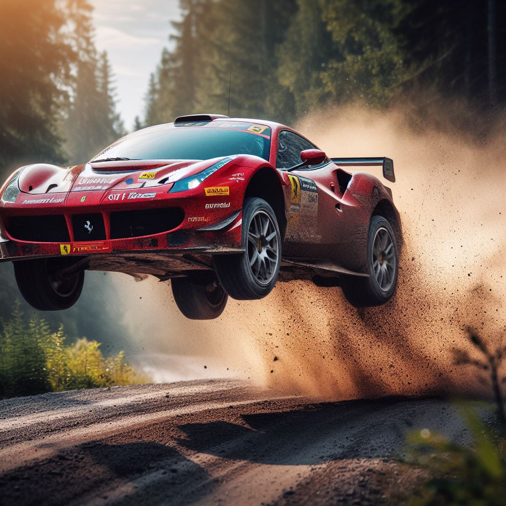
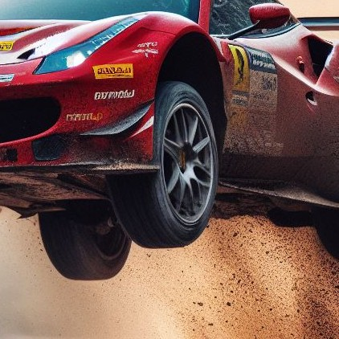

Ferrari ha anunciado su regreso al Campeonato Mundial de Rally (WRC) en 2024, después de una ausencia de más de 40 años. La marca italiana competirá con un nuevo coche de rally basado en el 296 GTB, su último superdeportivo híbrido.

"Estamos muy emocionados de anunciar nuestro regreso al WRC", dijo Mattia Binotto, director general de Ferrari. "El rally es una de las disciplinas más exigentes del automovilismo y es una oportunidad para que Ferrari demuestre su capacidad de innovación y rendimiento".

El nuevo coche de rally de Ferrari estará equipado con un motor V6 biturbo de 3.0 litros y 580 caballos de potencia, combinado con un motor eléctrico de 167 caballos de potencia. El sistema de propulsión híbrido proporciona una potencia total de 747 caballos de potencia y un par motor de 740 Nm.

El coche también contará con una serie de características aerodinámicas específicas para el rally, como un alerón trasero de gran tamaño y un difusor delantero. El chasis también ha sido reforzado para soportar las duras condiciones de los rallies.

Ferrari competirá en el WRC con un equipo de dos pilotos, formado por Carlos Sainz y Charles Leclerc. Sainz es un piloto experimentado con un palmarés que incluye dos campeonatos del mundo de rallycross y un título del WRC2. Leclerc es un joven piloto con un gran potencial, que ha ganado tres carreras en la Fórmula 1.

El regreso de Ferrari al WRC es una gran noticia para la categoría. La marca italiana es una de las más prestigiosas del automovilismo y su participación ayudará a aumentar el interés en el WRC.

Características técnicas del Ferrari 296 GTB WRC:

Motor: V6 biturbo de 3.0 litros y 580 caballos de potencia, combinado con un motor eléctrico de 167 caballos de potencia.
Potencia total: 747 caballos de potencia.
Par motor: 740 Nm.
Tracción: total
Cambio: secuencial de seis velocidades
Chasis: tubular de acero
Suspensión: independiente con amortiguadores ajustables
Frenos: discos ventilados
Aerodinámica: alerón trasero de gran tamaño, difusor delantero
Calendario del WRC 2024:

- 21-24 de enero: Rally de Montecarlo
- 11-14 de febrero: Rally de Suecia
- 3-6 de marzo: Rally de México
- 24-27 de marzo: Rally de Croacia
- 14-17 de abril: Rally de Portugal
- 28-31 de abril: Rally de Italia
- 19-22 de mayo: Rally de Finlandia
- 1-4 de junio: Rally de Kenia
- 15-18 de junio: Rally de Estonia
- 29-31 de julio: Rally de Turquía
- 12-15 de agosto: Rally de Alemania
- 26-29 de agosto: Rally de Bélgica
- 9-12 de septiembre: Rally de Gales
- 23-26 de septiembre: Rally de España
- 7-10 de octubre: Rally de Japón
- 21-24 de octubre: Rally de Australia
- 4-7 de noviembre: Rally de Nueva Zelanda
