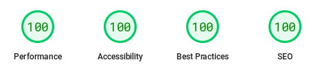

This year, I've been thinking about updating my website a lot. The previous one was a bit outdated, not for lack of interest, but because I wasn't able to get Grow to work again after I changed laptops, I admit it.

I tried several generators, including popular ones like Astro, Nuxt, and Next, and some less known ones. I finally settled on **[11ty](//11ty.dev)**, which is based on **JavaScript** and has great backward compatibility. I was able to start it up in several environments from scratch with just `npm install`.

## Decisions

I decided to use **[WebC](//www.11ty.dev/docs/languages/webc/)**, a JavaScript templating language that allows me to create reusable components. This allows me to create more modular and maintainable web pages.

> I try o make the faster website

I also decided to go with a **classless** design, where the HTML tags and their position determine the style of the elements. This allows me to create a cleaner and more efficient design.

## Performance and Accessibility

The website has been optimized for good performance and accessibility. In PageSpeed Insights tests, the website scored a perfect 100 on both desktop and mobile.

One thing that can slow down a website's load time is images. I decided to **remove all images** that are not essential. I'll keep the logo and favicon, which are both **SVG** files embedded in their components, but also added a background image for the logo through [lorem.picsum](//picsum.photos) for the new brand language I want. The images in the posts are uploaded separately, but at least I'm avoiding having you download a hero image to decorate the header.

> No images, no colors, no libraries

Another thing that can slow down a website's load time is external libraries and fonts. I've minimized both. I only use one for syntax highlighting in the posts, and **the fonts are downloaded after** the entire website has loaded.

Accessibility tests have also been performed to ensure that the website is accessible to people with disabilities.

The website uses a **high contrast** color scheme, with only white and black. There is also a **dark mode** that uses black and white. The **hierarchy of content** is evident in the spacing between elements, the use of two fonts, `Source Code Pro` for code, headings, and some navigation links, and `Lora` for body text.

The use of white and black is a good choice for **accessibility**, as it provides good contrast for people with visual impairments. The use of two fonts helps to **distinguish between different types of content**.

The spacing between elements helps to create a **clear and concise** layout. The use of headings helps to **organize the content** and make it easier to scan.

## New Features

The website has several new features, such as support for multiple languages, a new focus, and a new look.

The website is now ready to be translated into multiple languages. The website structure is divided into folders, and all templates are shared.

The focus of the website has changed. It is no longer an online portfolio, but rather a landing page for [ClassGap](//www.classgap.com/me/tomas-cornelles), the platform where I teach front-end programming.

These new features are accompanied by a new, more sober and mature look. The logo is generated with a web app that I created a while ago for the previous image. However, since it could not be seen at a reduced size, I created this solid version and played with the shape as if it were the cursor of the command terminal where we work. Depending on how you look at it, it also looks like a turned-off phone.

## Other Features

The website also includes Cypress tests for navigation and dynamic elements. GitHub Pages is also used as a server and GitHub Actions for continuous integration. The main branch has been blocked so that commits cannot be made directly to it. Instead, pull requests must be made from a branch (which I review myself). Cypress tests are run before a pull request can be merged.

## Conclusions

I am very happy with the results of the website update. It was fun to put together the whole structure and learn about other aspects of web development that I don't usually touch. Using WebC with SFC was a great success, as it allowed me to isolate functionality within components for reuse. For example, the post component is the same for the home page, the blog page, and the entry, but with different input parameters.

I also created other components that I haven't used yet, such as the analytics component. I preferred not to use it at the moment. This component offers, with just an instance in the HTML, the link to the cookie policy, the tracking code, which is loaded according to whether or not you have accepted cookies. It also takes care of displaying the message if you have not accepted or rejected it before.

## Your Opinion

What do you think? Would you change anything about the site? Were you familiar with all the technologies used? You can contact me through social media to share your opinion or suggest other topics.

